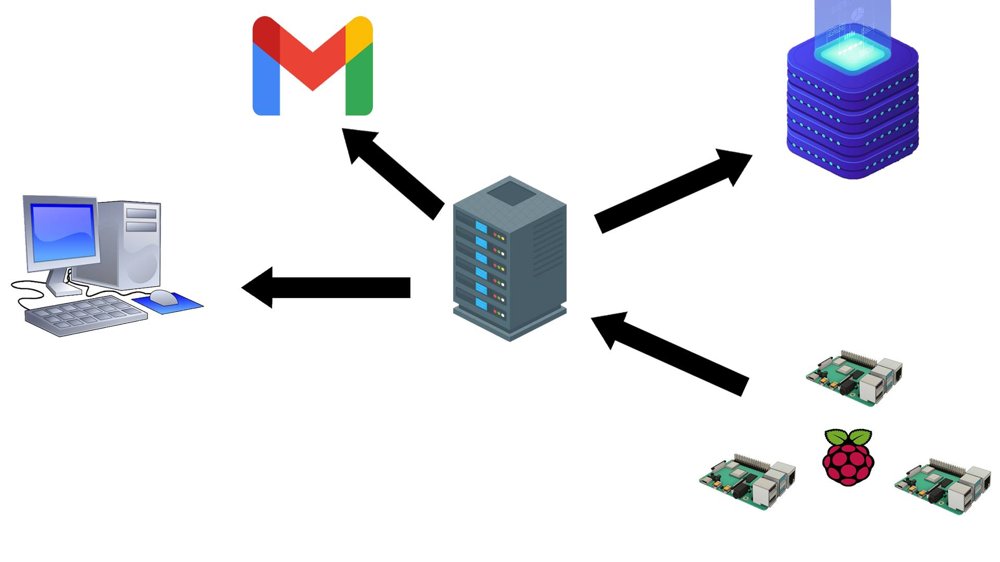

= IoT  Project 
Διαδίκτυο των Αντικειμένων (Εργαστήριο) - Ιωάννης Καμπεράκης - 71347254 
// Metadata:
:description: Intro and Install
:keywords: IoT
:data-uri:
:toc: right
:toc-title: Πίνακας περιεχομένων
:toclevels: 4
:source-highlighter: highlight
:icons: font
:sectnums:

{empty} +

== Εισαγωγή

.Τι περιέχει το Project;
****

Σε αυτό το Project αναπτύσσεται λογισμικό το οποίο προσομοιώνει την λειτουργία των Raspberry Pis. Ουσιαστικά παράγονται τυχαίες τιμές για την υγρασία του αέρα, του εδάφους, για την ένταση του αέρα και την ατμοσφαιρική θερμοκρασία και έπειτα στέλνονται στον server ανά 30 δευτερόλεπτα όσες τιμές έχουν ποσοστιαία διαφορά μεγαλύτερη του 10%.

Αφού ο server δεχθεί τα δεδομένα επεξεργάζεται την θερμοκρασία και την υγρασία του αέρα. Αν διαπιστωθεί ότι η θερμοκρασία αυξηθεί κατά 40% ή η υγρασία αέρα μειωθεί κατά 50%, αποστέλλεται μήνυμα στο Gmail. Έπειτα τα δεδομένα αποθηκεύονται στην βάση δεδομένων και στέλνωνται στον client ώστε να παρουσιαστούν σε γράφημα. 

[NOTE]
====

.Σχηματική αναπαράσταση του Project

Για την καλύτερη κατανόηση των ζητουμένων είναι σημαντική η σχηματική αναπαράσταση του Project. Κάτω δεξιά φαίνονται τα Raspberry Pi τα οποία στέλνουν δεδομένα στον server. Ο server στέλνει τα δεδομένα στην database για να αποθηκευθούν και άμα υπάρξει άνοδος στην θερμοκρασία ή μείωση στην υγρασία αέρα τότε στέλνει μήνυμα στο Gmail για να ειδοποιήσει. Τέλος, τα δεδομένα στέλνονται στον client για να αναπαρασταθούν σε γράφημα.

====

****

== Οδηγός εγκατάστασης λογισμικών

=== https://realpython.com/installing-python/#how-to-install-python-on-linux[Install Python3^] 

[TIP]
====
Αρχικά πρέπει να εγκατασταθεί η *Python* μιας και στο πρώτο βήμα το πρόγραμμα δημιουργείται με την χρήση της. 
====

[source.bash]
----
$ sudo apt-get update
$ sudo apt-get install python3.8 python3-pip
----

{empty} +

=== https://www.youtube.com/watch?v=hJMmxfAt6gM&ab_channel=CodeComplete-Thespiritofcoding[Install latest version of npm and Node.js ^]

[WARNING]
====
Εάν το πρόγραμμα *npm* δεν είναι εγκατεστημένο τότε δεν είναι εφικτό να κατεβάσουμε τα modules στον server (πχ Node.js), όμως η μη ανανέωση του μπορεί να αποτελέσει μεγάλο πρόβλημα καθώς δεν υπάρχει συμβατότητα με τις νέες εκδόσεις διαφόρων προγραμμάτων και τα νέα modules. 
====

[source.bash]
----
$ curl -o- https://raw.githubusercontent.com/nvm-sh/nvm/v0.35.3/install.sh | bash
$ source ~/.profile
$ nvm install node
----

{empty} +

=== https://requests.readthedocs.io/en/master/user/install/[Install requests ^]

[TIP]
====
Η *requests* είναι μία βιβλιοθήκη που παρέχει η Python για την αποστολή και ανταλλαγή HTTP μηνυμάτων. 
====

[source.bash]
----
$ python -m pip install requests
----

{empty} +

=== https://www.npmjs.com/package/json[Install JSON ^]

[TIP]
====
Το *JSON* είναι ένα format για την αποθήκευση και ανταλλαγή δεδομένων.
====

[source.bash]
----
$ npm install -g json
----

{empty} +

=== https://expressjs.com/en/starter/installing.html[Install Express.js^]

[TIP]
====
Το *Express.js* είναι ένα framework για την Node.js που χρησιμοποιείται για την δημιουργία web applications και API.
====

[source.bash]
----
$ npm install express --save
----

{empty} +

=== https://www.npmjs.com/package/nedb[Install NeDB^]

[TIP]
====
Η *NeDB* είναι ένα ενσωματωμένο έγγραφο DBMS γραμμένο σε JavaScript. Το NeDB είναι χρήσιμο για την αποθήκευση μικρών ποσοτήτων δεδομένων στη μνήμη. Όταν η ποσότητα των δεδομένων υπερβαίνει τα όρια του τι μπορεί να κρατήσει αποτελεσματικά το NeDB, η μετάβαση σε MongoDB προορίζεται να είναι απλή επειδή χρησιμοποιεί το ίδιο API.
====

[source.bash]
----
$ npm install nedb --save 
----

{empty} +

=== https://www.npmjs.com/package/nedb[Install dotenv^]

[TIP]
====
Με την *dotenv* μπορούμε να αποκρύψουμε προσωπικά δεδομένα που δεν θέλουμε να φανούν στον κώδικα όπως τα στοιχεία σύνδεσης σε μία βάση δεδομένων. Έτσι η σύνδεση γίνεται με μεγαλύτερη ασφάλεια και ο κώδικας μπορεί να δημοσιευθεί.
====

[source.bash]
----
$ npm install dotenv --save 
----

{empty} +

=== https://nodemailer.com/about/[Install nodemailer^]

[TIP]
====
O *nodemailer* είναι ένα module της Node.js που επιτρέπει την εύκολη αποστολή email.
====

[source.bash]
----
$ npm install nodemailer --save 
----

{empty} +

=== https://nodemailer.com/about/[Install Socket.IO for server^]

[TIP]
====
Το *Socket.IO* είναι μια βιβλιοθήκη JavaScript για εφαρμογές ιστού σε πραγματικό χρόνο που επιτρέπει αμφίδρομη επικοινωνία μεταξύ client και server.
====

[source.bash]
----
$ npm install socket.io
----

{empty} +

=== https://socket.io/docs/v3/client-installation/index.html[Install Socket.IO for client^]

[TIP]
====
Πρέπει να εγκατασταθούν οι βιβλιοθήκες για τον client και για τον server για να γίνει σωστή εκτέλεση.
====

[source.bash]
----
$ npm install socket.io-client -- save
----

{empty} +

== Περιγραφή του κώδικα
Σε αυτό το σημείο θα γίνει περιγραφεί του κώδικα που αναπτύχθηκε. Θα αναφερθούν οι λύσεις που δόθηκαν και τα προβλήματα που αντιμετωπίστηκαν. Ξεκινάμε με το πρώτο ζητούμενο που είναι η υλοποίηση λογισμικού που συλλέγει περιβαλλοντικά δεδομένα.

{empty} +

==== Υλοποίηση λογισμικού συσκευής ΙοΤ για συλλογή περιβαλλοντικών δεδομένων

Για το συγκεκριμένο ερώτημα αναπτύχθηκε αλγόριθμος στην Python που παράγει ψευδοτυχαίες τιμές για την θερμοκρασία, την υγρασία αέρα, την υγρασία νερού και τα μποφόρ. Στην πρώτη επανάληψη δεν γίνεται υπολογισμός της ποσοστιαίας διαφοράς επειδή δεν υπάρχει προηγούμενη μέτρηση (flag = 0). Γι' αυτό χρησιμοποιείται το flag. Αναγκάζει το πρόγραμμα να κάνει υπολογισμούς από την δεύτερη επανάληψη και μετά (όταν δηλαδή το flag γίνει 1). 

Στην αρχή του προγράμματος αρχικοποιούνται οι λίστες και οι μεταβλητές που θα χρησμοποιηθούν στο πρόγραμμα, μέσα στην while παράγονται οι μετρήσεις και εκτυπώνονται. Σημαντικό σημείό είναι η γραμμή 28 που φαίνεται στην πρώτη εικόνα που ακολουθεί, όπου το flag αποτρέπει το πρόγραμμα να εκτελεστεί την πρώτη φορά  και το σημείο όπου γίνεται το flag = 1 (γραμμή 100, δεύτερη εικόνα).

{empty} +

.Αρχικοποίηση τιμών, παραγωγή μετρήσεων και έλεγχος του flag
image:flag(1).jpg[alt="image"]

{empty} +

.Το flag γίνεται 1 και πλέον υπολογίζεται η ποσοστιαία διαφορά των μετρήσεων
image:flag(2).jpg[alt="image"]

{empty} +

Αφού υπάρχουν παλιές και νέες τιμές πλέον μπορεί να γίνει η επεξεργασία. Αρχικά ελέγχεται αν έχουν περάσει 5 λεπτά απο την τελευταία φορά που στάλθηκαν δεδομένα στον server, αν δεν ισχύει εκτελείται μία for για να γίνουν οι υπολογισμοί και στις 4 τιμές που προέκυψαν. Μέσα στην for ελέγχονται οι περιπτώσεις που ο αριθμητής είναι 0 ή ο παρονομαστής και γίνεται κατάλληλος χειρισμός. Αφού υπολογιστεί η ποσοστιαία διαφορά ελέγχεται αν είναι μεγαλύτερη του 10%, αν είναι τότε στέλνονται οι τιμές στον server μέσω της εντολής requests.post. Αυτή η διαδικασία επαναλαμβάνεται ανά 30 δευτερόλεπτα.

{empty} +

.Ελέγχεται αν έχουν περάσει 5 λεπτά και αν υπάρχουν μηδενικά ψηφία
image:code(1).jpg[alt="image"]

{empty} +

.Αν το ποσοστο που προέκυψε είναι μεγαλύτερο του 10%, στείλε τις τιμές στον server
image:code(2).jpg[alt="image"]

{empty} +

====  Αποστολή δεδομένων σε απομακρυσμένο server

Για να λάβει ο server τα δεδομένα πρέπει να πάρει με post τα requested δεδομένα. Στην γραμμή 43 γίνεται αυτή η διαδικασία. Στις επόμενες εικόνες φαίνονται οι βασικές εντολές που χρειάζονται για την δημιουργία ενός REST API server.

.Δημιουργία server
image:code(2.1).jpg[alt="image"]
image:code(2.2).jpg[alt="image"]
image:code(2.3).jpg[alt="image"]

{empty} +

====  Υλοποίηση υπηρεσίας επιτήρησης πραγματικού χρόνου

Για το συγκεκριμένο ερώτημα ήταν αναγκαία η προσθήκη των modules που φαίνονται στην παρακάτω εικόνα.

image:code(3.1).jpg[alt="image"]

Επίσης παράχθηκε και το αρχείο package.json το οποίο περιέχει τα dependencies που χρειάστηκαν.

.package.json
image:package.jpg[alt="image"]

Με τον body-parser λαμβάνουμε τα δεδομένα του python προγράμματος. Γι' αυτό και ορίζουμε το body-parser να δέχεται δεδομένα οποιουδήποτε τύπου. Το module nodemailer είναι αναγκαίο για την αποστολή email στο gmail. Στις επόμενες εικόνες φαίνονται οι αρχικοποίηση των μεταβλητών και των λιστών που χρησιμοποιούνται για την επεξεργασία των τιμών της θερμοκρασίας και της υγρασίας, η συνάρτηση που πραγματοποιεί του υπολογισμούς, ο προσδιορισμός της υπηρεσίας που θα σταλθεί email και η επεξεργασία των τιμών της θερμοκρασίας και της υγρασίας αέρος.

.Αρχικοποίηση μεταβλητών και λιστών
image:code(3.2).jpg[alt="image"]

.Συνάρτηση υπολογισμού, ορισμός υπηρεσίας και επεξεργασία των θερμοκρασιών
image:code(3.4).jpg[alt="image"]

.Επεξεργασία υγρασίας αέρος 
image:code(3.5).jpg[alt="image"]

Αφού υπολογιστούν οι ποσοστιαίες διαφορές ελέγχεται αν η θερμοκρασία ανέβηκε κατά 40% και αν η υγρασία μειώθηκε κατα 50%. Αν συμβαίνει ένα από τα δύο τότε στέλνεται μήνυμα στο email που φαίνεται για να ειδοποιηθεί ο διαχειριστής.

.Έλεγχος θερμοκρασίας, αποστολή email
image:code(3.6).jpg[alt="image"]

.Έλεγχος υγρασίας αέρα, αποστολή email
image:code(3.7).jpg[alt="image"]

[CAUTION]
====
Στο συγκεκριμένο ερώτημα παρουσιάστηκαν ορισμένα προβλήματα. Αρχικά ήθελα να υλοποιήσω το ερώτημα στέλνοντας SMS μηνύματα όμως οι υπηρεσίες που έβρισκα (Twilio, Sinch, way2sms, infobip) δεν ήταν ελληνικές και δεν παρείχαν δωρεάν υπηρεσίες για άλλες χώρες πέρα απο την δική τους. ΒΡήκα και μία Ελληνική όμως έπρεπε να πληρώσω κάποιο ποσό. Το Gmail δεν με άφηνε να στείλω μηνύματα για λόγους προστασίας όμως κατάφερα να στείλω ενεργοποιώντας μία λειτουργία που δίνει μεγαλύτερη ελευθερία στα μηνύματα που δέχεται το email μου.
====

{empty} +

====  Αποθήκευση των δεδομένων σε βάση δεδομένων

Για την αποθήκευση των δεδομένων δημιουργήθηκε μία NeDB. Επιλέχθηκε η συγκεκριμένη βάση δεδομένων επειδή δεν υπάρχουν υψηλές απαιτήσεις μνήμης από την εφαρμογή που υλοποιείται. Στην πρώτη εικόνα φαίνονται τα modules που προστέθηκαν για το συγκεκριμένο ερώτημα. Με την socket.io θα στέλνονται τα δεδομένα στον client και θα απεικονίζονται στα γραφήματα. Η dotenv παρέχει προστασία των δεδομένων, σε αυτή την περίπτωση προστατεύονται τα στοιχεία σύνδεσεις για την βάση δεδομένων με την χρήση του αρχείου .env και .gitignore.

.Νέα modules
image:code(4.1).jpg[alt="image"]
 
Στην συνέχεια φαίνεται η αρχικοποίηση των μεταβλητών και των λιστών που χρησιμοποιούνται για την αποστολή των δεδομένων στον client. 

.Αρχικοποίηση μεταβλητών και λιστών
image:code(4.2).jpg[alt="image"]

Έπειτα δημιουργείται η βάση δεδομένων που θα χρησιμοποιηθεί με όνομα rasp_measurements.db. Στις γραμμές 34 έως 36 στέλνεται στον client η html σελίδα που θα βλέπει τα αποτελέσματα.

.Δημιουργία βάσης δεδομένων
image:code(4.3).jpg[alt="image"]

Η ιστοσελίδα που θα βλέπει ο χρήστης αποτελείται από τον παρακάτω κώδικα.

.page.html
image:page(1).jpg[alt="image"]
image:page(2).jpg[alt="image"]

Όταν η ποσοστιαία διαφορά των μετρήσεων είναι μεγαλύτερη του 10 τότε εκχωρούνται οι τιμές σε μία λίστα όπου στο τέλος της μπαίνει ένα συγκεκριμένο id ανάλογα την μέτρηση (πχ για temp -> 0). Μόλις αυτές οι λίστες γεμίσουν τότε στέλνονται με custon event (emit) στον client ώστε οι τιμές που περιέχουν να απεικονιστούν στο γράφημα. Αυτη η διαδικασία γίνεται για όλες τις μετρήσεις. Το id βοηθάει στην σωστή απεικόνιση των δεδομένων.

.Είσοδος των τιμών της θερμοκρασίας στην DB και αποστολή των 10 πρώτων τιμών της στον client
image:code(4.4).jpg[alt="image"]

.Είσοδος των τιμών της υγραίας αέρος στην DB και αποστολή των 10 πρώτων τιμών της στον client
image:code(4.5).jpg[alt="image"]

.Είσοδος των τιμών της υγραίας εδάφους και των μποφόρ στην DB και αποστολή των 10 πρώτων τιμών τους στον client
image:code(4.6).jpg[alt="image"]

